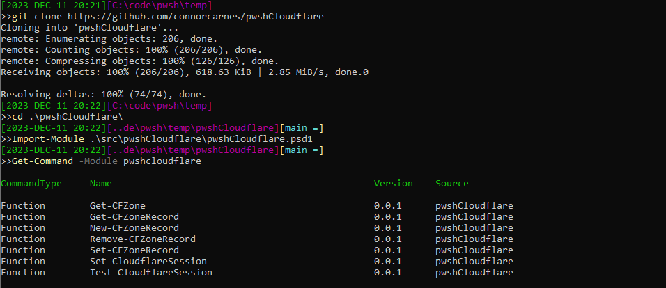

# pwshCloudflare

## Synopsis

PowerShell module for interacting with the Cloudflare API.

## Description

TBD

## Getting Started

### Installation

Will be published to PSGallery in the future. For now clone this repo and import the module.



### Authentication

TBD

### Quick start

#### Example1

```powershell
# command showing how to use your project

```
